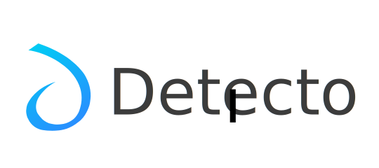

--------------------------------------

[](https://circleci.com/gh/alankbi/detecto/tree/master)
[](https://detecto.readthedocs.io/en/latest/?badge=latest)


Detecto is a Python package that allows you to build fully-functioning computer vision and object detection models with just 5 lines of code. 
Inference on still images and videos, transfer learning on custom datasets, and serialization of models to files are just a few of Detecto's features. 
Detecto is also built on top of PyTorch, allowing an easy transfer of models between the two libraries.

The table below shows a few examples of Detecto's performance:   

Still Image                                                                   |  Video
:----------------------------------------------------------------------------:|:-----------------------------------------:
 | 

# Installation

To install Detecto using pip, run the following command:

`pip3 install detecto`

Installing with pip should download all of Detecto's dependencies automatically. 
However, if an issue arises, you can manually download the dependencies listed in the [requirements.txt](requirements.txt) file.

# Usage

The power of Detecto comes from its simplicity and ease of use. Creating and running a pre-trained 
[Faster R-CNN ResNet-50 FPN](https://pytorch.org/docs/stable/torchvision/models.html#object-detection-instance-segmentation-and-person-keypoint-detection) 
from PyTorch's model zoo takes 4 lines of code:

```python
from detecto.core import Model
from detecto.visualize import detect_video

model = Model()  # Initialize a pre-trained model
detect_video(model, 'input_video.mp4', 'output.avi')  # Run inference on a video
```

Below are several more examples of things you can do with Detecto:

### Transfer Learning on Custom Datasets

Most of the times, you want a computer vision model that can detect custom objects. With Detecto, you can train a model on a custom dataset with 5 lines of code: 

```python
from detecto.core import Model, Dataset

dataset = Dataset('custom_dataset/')  # Load images and label data from the custom_dataset/ folder

model = Model(['dog', 'cat', 'rabbit'])  # Train to predict dogs, cats, and rabbits
model.fit(dataset)

model.predict(...)  # Start using your trained model!
```

### Inference and Visualization

When using a model for inference, Detecto returns predictions in an easy-to-use format and provides several visualization tools:

```python

from detecto.core import Model
from detecto import utils, visualize

model = Model()

image = utils.read_image('image.jpg')  # Helper function to read in images

labels, boxes, scores = model.predict(image)  # Get all predictions on an image
predictions = model.predict_top(image)  # Same as above, but returns only the top predictions

print(labels, boxes, scores)
print(predictions)

visualize.show_labeled_image(image, boxes, labels)  # Plot predictions on a single image

images = [...]
visualize.plot_prediction_grid(model, images)  # Plot predictions on a list of images

visualize.detect_video(model, 'input_video.mp4', 'output.avi')  # Run inference on a video
```

### Advanced Usage

If you want more control over how you train your model, Detecto lets you do just that:

```python

from detecto import core, utils
from torchvision import transforms
import matplotlib.pyplot as plt

# Convert XML files to CSV format
utils.xml_to_csv('training_labels/', 'train_labels.csv')
utils.xml_to_csv('validation_labels/', 'val_labels.csv')

# Define custom transforms to apply to your dataset
custom_transforms = transforms.Compose([
    transforms.ToPILImage(),
    transforms.Resize(800),
    transforms.ColorJitter(saturation=0.3),
    transforms.ToTensor(),
    utils.normalize_transform(),
])

# Pass in a CSV file instead of XML files for faster Dataset initialization speeds
dataset = core.Dataset('train_labels.csv', 'images/', transform=custom_transforms)
val_dataset = core.Dataset('val_labels.csv', 'val_images')  # Validation dataset for training

# Create your own DataLoader with custom options
loader = core.DataLoader(dataset, batch_size=2, shuffle=True) 

model = core.Model(['car', 'truck', 'boat', 'plane'])
losses = model.fit(loader, val_dataset, epochs=15, learning_rate=0.001, verbose=True)

plt.plot(losses)  # Visualize loss throughout training
plt.show()

model.save('model_weights.pth')  # Save model to a file

# Directly access underlying torchvision model for even more control
torch_model = model.get_internal_model()
print(type(torch_model))
```

For more examples, visit the [docs](https://detecto.readthedocs.io/), which includes a [quickstart](https://detecto.readthedocs.io/en/latest/usage/quickstart.html) tutorial.

Alternatively, check out the [demo on Colab](https://colab.research.google.com/drive/1ISaTV5F-7b4i2QqtjTa7ToDPQ2k8qEe0).  

# API Documentation

The full API documentation can be found at [detecto.readthedocs.io](https://detecto.readthedocs.io/en/latest/api/index.html).
The docs are split into three sections, each corresponding to one of Detecto's modules:

### Core

The [detecto.core](https://detecto.readthedocs.io/en/latest/api/core.html) module contains the central classes of the package: Dataset, DataLoader, and Model. 
These are used to read in a labeled dataset and train a functioning object detection model.

### Utils

The [detecto.utils](https://detecto.readthedocs.io/en/latest/api/utils.html) module contains a variety of useful helper functions. 
With it, you can read in images, convert XML files into CSV files, apply standard transforms to images, and more.

### Visualize

The [detecto.visualize](https://detecto.readthedocs.io/en/latest/api/visualize.html) module is used to display labeled images, plot predictions, and run object detection on videos.


# Contributing

All issues and pull requests are welcome! To run the code locally, first fork the repository and then run the following commands on your computer: 

```bash
git clone https://github.com/<your-username>/detecto.git
cd detecto
# Recommended to create a virtual environment before the next step
pip3 install -r requirements.txt
```

When adding code, be sure to write unit tests and docstrings where necessary. 

Tests are located in `detecto/tests` and can be run using pytest:

`python3 -m pytest`

To generate the documentation locally, run the following commands:

```bash
cd docs
make html
```

The documentation can then be viewed at `docs/_build/html/index.html`.

## Contact

Detecto was created by [Alan Bi](https://www.alanbi.com/). Feel free to reach out on [Twitter](https://twitter.com/alankbi) or through [email](mailto:alan.bi326@gmail.com)!
